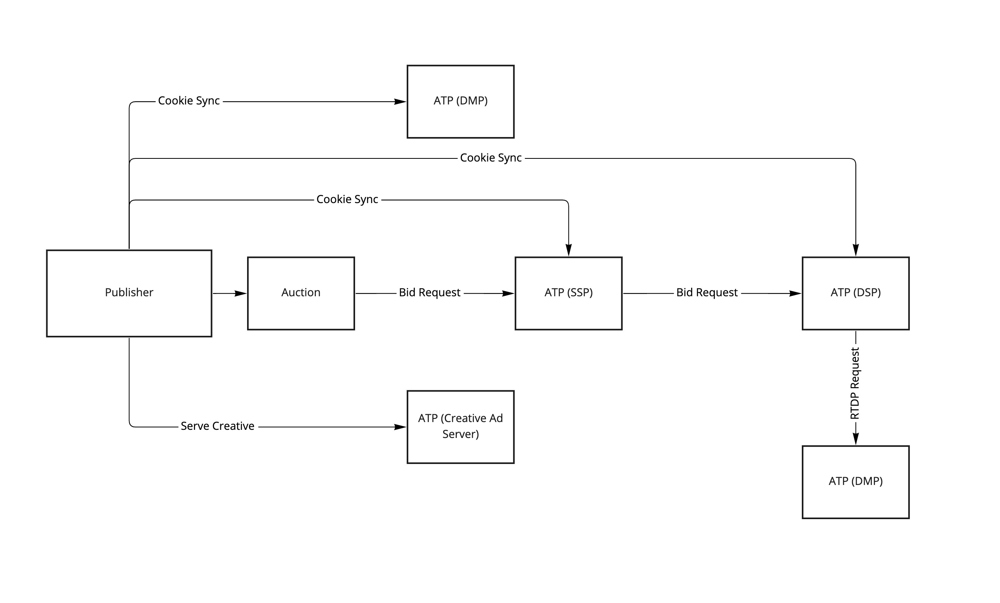
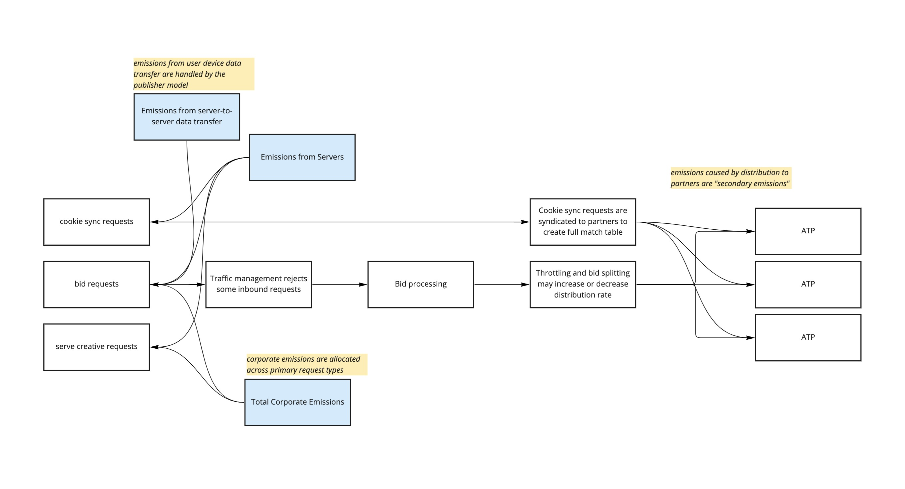

# Methodology to Measure Emissions from Ad Tech Platforms

The ad tech platform (ATP) model is built around the idea that ATPs integrate with other ATPs as part of a directed graph starting from the publisher. For instance, making a bid request to an SSP will generate many more bid requests to DSPs and possibly to real-time data providers as well.



## Types of Ad Tech Platform

This model provides templates for various types of ATPs. In the words of Mike Nolet, what matters about ad tech companies is not what they say they are, it's what they actually do that matters. Thus, it doesn't really matter to the model whether a company is an ad network or an exchange or an SSP; what matters is how the company (or, technically, a particular product) integrates with publishers and other ad tech companies and what activities it performs.

The templates in the `templates` directory are used to pull default values for how a particular product is likely to operate in the above context.

## Ad Tech Provider Emissions Model

The ATP model assumes that there will be various requests coming from a publisher (on the left of the below diagram) that will trigger downstream actions (the white boxes) and consume various resources (the blue boxes).


Running the ATP model in verbose mode will show the calculations being used, and they are detailed in the `./scope3_methodology/cli/model_ad_tech_platform.py` and `./scope3_methodology/ad_tech_platform`.

## Primary vs Secondary Emissions

Our model outputs the primary emissions from an ATP, in other words, what happens within the direct control of the ATP. This includes their scope 1, 2, and 3 emissions _except_ for the emissions due to downstream distribution partners. In the context of a graph, this means we are outputting the emissions from each node, but not following the edges.

We do provide functions that can take a list of the edges (`DistributionPartner` objects) and will compute the secondary emissions. At Scope3, we first model all of the primary emissions then use our graph of ATP relationships to compute the fully-loaded cost of each type of request.

## Measuring ATP cloud Infrastructure

Along with the primary and secondary emission measurements from the Use Phase Energy (UPE) of providing services to it an ad tech's customers
. We need to measure the Production Energy per Use Second (PEPS) of the ad tech
provider's infrastructure. The PEPS or Life Cycle Assessment (LCA) of the physical infrastructure is the measure of the emissions due to the production of the resources, this includes servers, network gear cabinets, power supplies, cabling etc.
This hardware may be deployed in public or private cloud and its and is
generally not publicly available. See this spreadsheet template [ATP Template](/docs/supporting/Scope3ATPTemplate.xlsx) on the information what we collect to measure an ATP.
See the description of [corporate emissions](/docs/corporate_model.md) that describe how we treat carbon offsets, REC's and PPA.

## Usage

Create a YAML file that describes the company you would like to model. The YAML file should look like this:

```yaml
---
type: atp
company: Criteo
products:
  - name: Criteo
    template: network
    identifier: criteo.com
    # Facts directly used as model inputs
    facts:
      - server_emissions_mt_co2e_per_month: 3583
        reference: page 85
        source_id: 1
      - server_emissions_g_co2e_per_kwh: 649.8
      - corporate_emissions_g_co2e_per_bid_request: 0.00015648471735020598
        comment: "Output of model Sept 20, 2022"
    # Raw facts are not direclty used within the model. But give additional info
    raw_facts:
      - servers: 40000
        reference: page 7
        source_id: 1
      - server_electricity_kwh_per_month: 5514583
        reference: page 85
        source_id: 1
      - server_embodied_emissions_pct: 25
        reference: page 86
        source_id: 1
      - server_electricity_kwh_per_server_per_month: 137.9
      - server_adjusted_emissions_mt_per_month: 3583
        comment: no adjustment needed because embodied emissions are included
    sources:
      - id: 1
        year: 2021
        url: >-
          https://filecache.investorroom.com/mr5ir_criteo/1674/Criteo_CSR_Report_2021.pdf
        file: Criteo_CSR_Report_2021.pdf
```

The file must have:

- `company` which is the name of the company
- `products` with at least one product
- Each product should specify a template from the `templates` directory

To model emissions, make sure defaults have been computed. Then run:

```sh
./scope3_methodology/cli/model_ad_tech_platform.py --verbose  [--corporateEmissionsG]  [--corporateEmissionsGPerRequest] [company_file.yaml]
```

If you want to see how the secondary emissions would be modeled, pass in `-p N` where N is the number of partners to simulate.

## Caveats and Concerns

- There are not many public data sources available for ad tech companies. Criteo published its first sustainability report in the summer of 2022 - huge kudos! - and we have heard from many other companies that they are working on sustainability projects. Until we have more sources, we will not be able to make the generic model particularly accurate.
- The data we have, even from private sources, is spotty and inconsistent. This is largely because there has been no reason to gather sustainability data, and also because it can be very difficult to properly measure and allocate compute and other costs to particular products and activities. At AppNexus, we had a full time PhD working on capacity modeling!
- Ad tech companies are complicated and often have many products. For instance, using Criteo as an example, they have a retail media product, their retargeting network, and also operate as an SSP in certain cases. They recently purchased IPonWeb. There is no way to breakout or reasonably estimate the emissions per request for each of these. In many cases, it isn't possible to know from a particular ad tag or call which of these products is being used.
