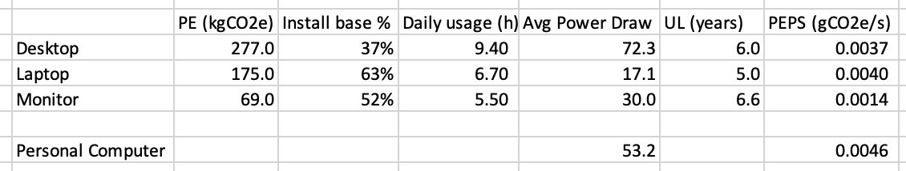

# Measuring Emissions for Consumer Devices

## Overview of Emissions by Device

This graphic, from [Malmodin and Lundén](#malmodin-and-lundén-2018), is a useful overview of emissions from production vs use phase. Note that the numbers here are slightly different than the aggregated conclusions we draw below.

## Calculating Lifecycle Emissions Per Second of Use

The _Lifecycle Annual Footprint_ (LAF) of a particular device, per [Belkhir and Elmeligi](#belkhir-and-elmeligi-2018), is the Use Phase Energy (UPE) plus the Production Energy (PE) divided by the Useful Life (UL). In other words, "the Lifecycle Annual Footprint accounts for the annual footprint of both the use phase as well as the production energy, depreciating the production energy over the useful lifetime of the device.

$LAF = {UPE + PE \over UL}$

Production is done around the world, not where consumer use occurs, whereas we need to calculate the UPE based on the consumer's grid mix. We calculate _Production Energy per Use Second_ (PEPS) using the daily usage in hours (DU):

$PEPS = {PE \over 365 • UL • DU • 3600}$

To calculate the _Lifecycle Emissions Per Second of Use_ (LEPS), we multiply the grid intensity of the consumer's location (GI) and the usage energy of the consumer device (UEPS) and add this to the production energy per second (PEPS).

$LEPS = {PEPS + GI • UEPS}$

The following sections outline the sources and assumptions used to calculate these metrics for various device types.

## Personal Computer

From [Belkhir and Elmeligi](#belkhir-and-elmeligi-2018):

| Device      | Production Energy (kgCO2e) | Useful Life (years) |
| ----------- | -------------------------- | ------------------- |
| Desktop     | 218 - 628                  | 5.5                 |
| Laptop      | 281 - 468                  | 7                   |
| LCD Monitor | 95                         | 6.6                 |

From [Urban et al](#urban-et-al-2019):

| Device  | Installed base (M) | Power Draw (w)         | Usage (h/day)            |
| ------- | ------------------ | ---------------------- | ------------------------ |
| Desktop | 72                 | 59 (idle), 85 (active) | 4.6 (idle), 4.8 (active) |
| Laptop  | 122                | 11 (idle), 22 (active) | 3.0 (idle), 3.7 (active) |
| Monitor | 101                | 30                     | 5.5                      |

Since we do not know the exact device a consumer is using (most reporting is aggregated to device type), we use install base to create a synthetic "personal computer". See [PC emissions model](./pc_emissions_model.xlsx). Based on this analysis, a personal conputer uses an average of 53.2 W of energy while in use, and has Production Energy of 0.007 gCO2e per second of use.

## Tablet

From [Belkhir and Elmeligi](#belkhir-and-elmeligi-2018):
| Device | Production Energy (kgCO2e) | Useful Life (years)
| --- | --- | ---
| Tablet | 80 - 116 | 7

We don't have a stat on daily usage of tablets. Assuming that people use them in lieu of a laptop, taking the laptop number of 6.7 hours a day. This yields a PEPS of 0.0016 gCO2e/s.

For energy use, [iBatteryLife](https://ibatterylife.com/ipad-battery-life-test/) compares multiple iPad models and battery life is around 10 hours for each. The average iPad, per [Sir Apfelot](https://sir-apfelot.de/en/battery-capacity-ipad-mah-19060/), has around 30 Wh of battery capacity. Thus, a tablet has an average power draw of 3W.

## Smartphone

From [Belkhir and Elmeligi](#belkhir-and-elmeligi-2018):
| Device | Production Energy (kgCO2e) | Useful Life (years)
| --- | --- | ---
| Smartphone | 40 - 80 | 2

As an example, per [GSM Arena](#gsmarena), the Apple iPhone 13 takes 16 hours and 8 minutes to run out of battery when browsing the internet (similar to video playback). In idle mode, it takes 174 hours to discharge. It has 12.41Wh of battery capacity per [Macworld](#macworld). Thus, the iphone consumes 0.77W when active, and 0.071W when idle.

The typical person uses her phone for 4 hours and 23 minutes a day per [Statista](https://www.statista.com/statistics/1045353/mobile-device-daily-usage-time-in-the-us/). This yields a PEPS of 0.0052 gCO2e/s.

## Television

From [Urban et al](#urban-bryan-and-roth-2019):

| Device           | Installed base (M) | Power Draw (w)       | Usage (h/day)           |
| ---------------- | ------------------ | -------------------- | ----------------------- |
| Television       | 284                | 74                   | 3.9                     |
| STB: Non-DVR     | 113                | 22                   | 11.7                    |
| STB: DVR         | 54                 | 13                   | 11.7                    |
| STB: Thin Client | 33                 | 7                    | 11.7                    |
| STB: DTA Adapter | 31                 | 5                    | 24                      |
| Sound Bar        | 20                 | 14 (active) 9 (idle) | 4.4 (active) 5.7 (idle) |

We combine these using install base to create a synthetic "TV System" that represents the full power draw of the consumer setup. The weighted power draw of a typical setup is 87.4 watts.

From [Hischier and Baudin](#hischier-and-baudin-2010), the production energy of a 42" plasma television is 637kg. Per [Kwiecień et al](#kwiecień-et-al-2019) the average useful life of a plasma TV is 6 years. We do not have data on the embodied emissions from set top boxes or sound bars so these are omitted from the current analysis. Based on the 3.9 hours a day of usage, the embodied emissions from a plasma TV are 0.021 gCO2e/s.

## Summary

| Device            | Power Draw (W) | PEPS (gCO2e/s) |
| ----------------- | -------------- | -------------- |
| Personal computer | 53.2           | 0.007          |
| Tablet            | 3              | 0.0016         |
| Smartphone        | 0.77           | 0.0052         |
| TV System         | 87.4           | 0.021          |

## Notes and Caveats

- All of our data is US-centric and probably does not represent typical devices or configurations in less-wealthy countries.

## References

### Belkhir and Elmeligi, 2018

Lotfi Belkhir, Ahmed Elmeligi,
[Assessing ICT global emissions footprint: Trends to 2040 & recommendations](https://doi.org/10.1016/j.jclepro.2017.12.239),
Journal of Cleaner Production, Volume 177, 2018, Pages 448-463, ISSN 0959-6526.

### Macworld

[iPhone Battery Capacities Compared](https://www.macworld.com/article/678413/iphone-battery-capacities-compared-all-iphones-battery-life-in-mah-and-wh.html)

### GSM Arena

[GSM Arena battery calculator](https://www.gsmarena.com/battery-test.php3)

### Urban et al, 2019

Urban, Bryan & Roth, Kurt & Singh, Mahendra & Howes, Duncan. (2019). [Residential Consumer Electronics Energy Consumption in the United States in 2017](https://www.researchgate.net/publication/335911295_Residential_Consumer_Electronics_Energy_Consumption_in_the_United_States_in_2017). 10.2760/667696.

### Hischier and Baudin, 2010

Hischier, Roland & Baudin, Isabelle. (2010). [LCA study of a plasma television device](https://www.researchgate.net/publication/226516835_LCA_study_of_a_plasma_television_device). The International Journal of Life Cycle Assessment. 15. 428-438. 10.1007/s11367-010-0169-2.

### Kwiecień et al, 2019

Kwiecień, Klaudia & Kania, Gabriela & Malinowski, Mateusz. (2019). [The life cycle assessment (LCA) of selected TV models](https://www.researchgate.net/publication/341785058_The_life_cycle_assessment_LCA_of_selected_TV_models).

### Malmodin and Lundén, 2018

Malmodin J, Lundén D. [The Energy and Carbon Footprint of the Global ICT and E&M Sectors 2010–2015](https://doi.org/10.3390/su10093027). Sustainability. 2018; 10(9):3027.
