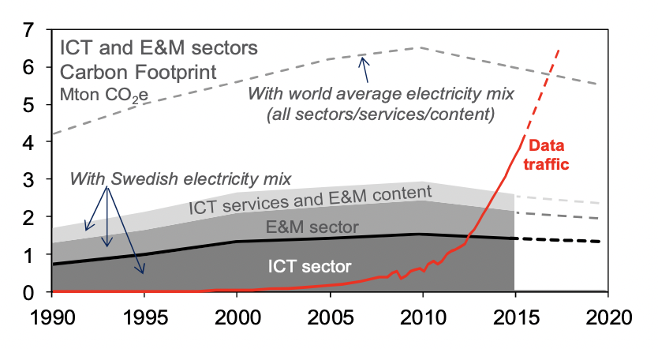
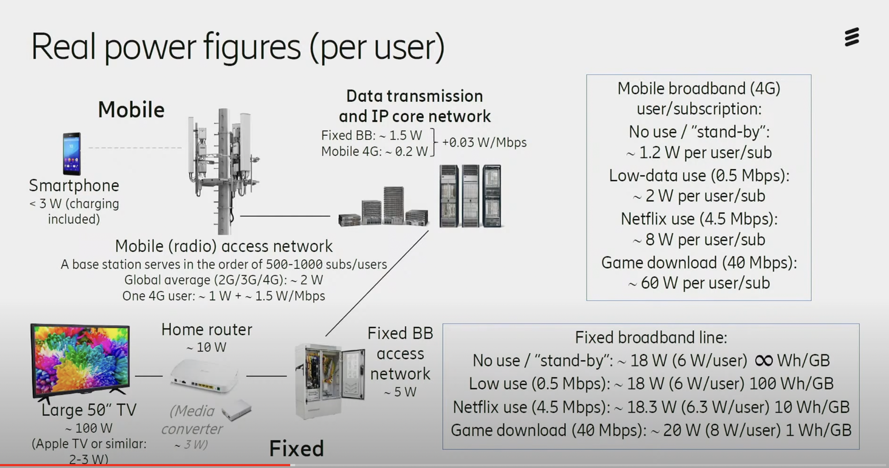

# Emissions from Data Transfer

## Approaches
As a starting point in understanding all the various approaches for understanding the carbon footprint of various networks, we recommend [this article by Gauthier Roussilhe](https://gauthierroussilhe.com/articles/explications-sur-l-empreinte-carbone-du-streaming-et-du-transfert-de-donnees).

## Carbon Footprint of the ICT Sector as a Whole

As a sanity check on the total environmental impact of network infrastructure, this paper: [The electricity consumption and operational carbon emissions of ICT network operators](https://www.diva-portal.org/smash/get/diva2:1177210/FULLTEXT01.pdf) uses confidential information provided by network operators to produce an estimate of the total and per-subscriber emissions.

> - The total annual operational carbon emissions of the ICT networks are estimated to 169 Mtonnes CO2e for 2015. This corresponds to 0.53% of the global carbon emissions related to energy (about 32 Gtonnes), or 0.34% of all carbon emissions (about 50 Gtonnes).
> - The total annual operational electricity consumption of the overall ICT networks globally is estimated to 242 TWh for 2015 including both grid (215 TWh) and on-site generated electricity (27 TWh). The total corresponds to 1.15% of the total electricity grid supply.

## Power consumption per network subscriber

The paper shows that electricity use and emissions per subscriber are relatively flat over the period 2010 to 2015 due to increased efficiency of the underlying technology (Moore's law), and demonstrates that electricity use and emissions are not growing proportionately to data transfer, which grew dramatically over this period.

The paper calculates emissions per fixed broadband (37 kgCO2e/sub) and mobile (14 kgCO2e/sub) subscribers, with an average of 19 kgCO2e per subscriber.

The same author, Jens Malmodin, produced a graphic showing the sources of power usage per user at the [Science & Society Forum](https://www.youtube.com/watch?v=Xo0PB5i_b4Y&t=2520s) in Sweden in 2020:

These bottom-up numbers indicate that the majority of emissions from broadband users are fixed and change little based on data transfer, while mobile emissions are somewhat based upon data transfer (presumably because the access network uses energy to transmit more actively). An expansion of this analysis that compares to other assessments of emissions from network use can be found in *IEA (2020), [The carbon footprint of streaming video: fact-checking the headlines]( https://www.iea.org/commentaries/the-carbon-footprint-of-streaming-video-fact-checking-the-headlines), IEA, Paris*

## Power usage by bandwidth

For mobile vs fixed data there is a great [2020 EU study](https://circabc.europa.eu/sd/a/8b7319ba-ce4f-49ea-a6e6-b28df00b20d1/ICT%20impact%20study%20final.pdf) that provides 0.03 kWh/GB for fixed, 0.14 kWh/GB for mobile. The 0.03 kW/GB number aligns with what is in the graphic above (0.03 W/Mbps)?

| Connection type | Device | KWh / GB
| --- | --- | ---
| Mobile | Any | 0.03
| Fixed broadband | Any | 0.14
| Unknown | Smartphone | 0.03
| Unknown | TV, PC, or Tablet | 0.14
| Unknown | Unknown | 0.10

When we don't know anything about the connection, we are using a value of 0.1 kWh per GB from the [most recent peer-reviewed study](https://www.mdpi.com/2071-1050/10/7/2494) we have found to estimate emissions from data transfer. 

## References

### Malmodin and Lundén, 2018

Malmodin J, Lundén D. [The Energy and Carbon Footprint of the Global ICT and E&M Sectors 2010–2015](https://doi.org/10.3390/su10093027). Sustainability. 2018; 10(9):3027.
