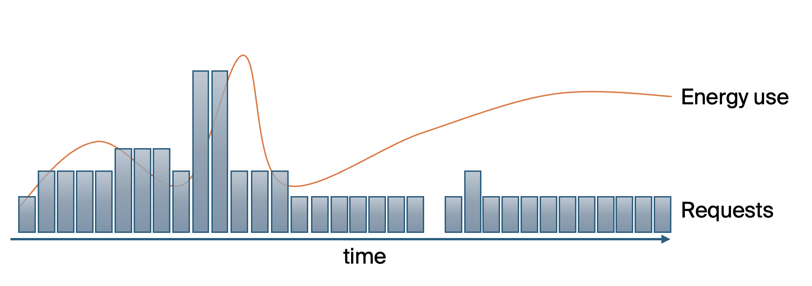

## Overview

An "inference service" is a service that exposes a single model for inference. This service will be hosted on a cluster of servers or cloud instances, potentially with reserved capacity and the ability to auto-scale with volume.

For purposes of this document, a "request" is the full prompt or input made to the inference service, and a "response" is the text, image, audio, or video returned to the client. The execution of the underlying model is an "inference".



To compute the environment impact of a request, we:
1. calculate cluster energy use on a continuous basis
2. use activity logs to calculate the number of concurrent requests at each time
3. calculate the energy use per second of request duration
4. model the expected request duration for a given set of request parameters

## Cluster energy use

The cluster is defined by:
- [Cluster](/cluster) details
- Cluster location(s) - if hosted in a cloud, which region(s)
- Cluster throughput (per server/instance if autoscaling)

On a running basis - ideally measured every few seconds - provide:
- The size of the cluster in nodes (to account for autoscaling)
- The CPU utilization of each node
- The utilization of each GPU
- The power usage of each GPU

As an example, NVIDIA's Triton inference server provides these data through a [metrics service](https://docs.nvidia.com/deeplearning/triton-inference-server/user-guide/docs/user_guide/metrics.html).

## Activity logs

For each request, provide:

- Timestamp when computation began
- Time taken to execute the computation phase of the request
- Input and output metrics (see below for examples by use case)

### Image metrics
- Input and output size
- Output quality
- LoRA model(s) used

LoRA model training can be modeled using the same methodology as full models.

### Text generation / chat parameters
- Input tokens
- Output tokens

## Energy per request duration and complexity

For each request, predict the duration (`predicted_request_duration`) and the number of inferences (`predicted_inferences`). A simple prediction might be:
```
predicted_request_duration = avg(duration)
predicted_inferences = (average output tokens + 1)
```

Calculate the marginal energy per inference:
```
marginal_gpu_per_inference = sum(gpu_pct)/sum(inferences)
marginal_cpu_per_inference = sum(cpu_pct)/sum(inferences)

marginal_energy_per_gpu_pct = E(1,0) - E(0, 0)
marginal_energy_per_cpu_pct = E(0,1) - E(0, 0)

marginal_energy_per_inference = marginal_gpu_per_inference x marginal_energy_per_gpu_pct +
                                marginal_cpu_per_inference x marginal_energy_per_cpu_pct
```

Calculate the energy use for a request, taking into account the idle cluster power:
```
usage_energy_per_request = idle_cluster_power x predicted_request_duration +
                     marginal_energy_per_inference x predicted_inferences
```

## Calculating emissions and water usage for a request

Calculate embodied emissions and water usage using predicted request duration:
```
embodied_emissions_per_second = EmbEm(1) / 3600
embodied_emissions_per_request = predicted_request_duration x embodied_emissions_per_second

embodied_h2o_per_second = EmbH2O(1) / 3600
embodied_h2o_per_request = predicted_request_duration x embodied_h2o_per_second
```

Calculate the training and fine-tuning emissions using:
- The base model used including the current [amortized training cost per inference](/training#amortization-of-impact-across-use-life)
- The current [amortized fine-tuning cost per inference](/fine_tuning#amortization-of-fine-tuning-impact-across-use-life) if applicable
```
training_emissions_per_request = predicted_inferences x
                                 (training_emissions_per_request + fine_tuning_emissions_per_request)
training_h20_per_request = predicted_inferences x
                                 (training_h20_per_request + fine_tuning_h20_per_request)
```

Sum all emissions and water use to produce total impact for a request:

```
request_emissions = usage_energy_per_request x (average grid intensity) +
                    embodied_emissions_per_request +
                    training_emissions_per_request

request_h20_impact = usage_energy_per_request x (cluster WUE) +
                    embodied_h2o_per_request +
                    training_h2o_per_request
```

## Various research findings

To model inference requires understanding the emissions per inference for a model on a particular host given certain parameters. There are *many* factors that determine how a model is executed including [batching strategies](https://www.anyscale.com/blog/continuous-batching-llm-inference#continuous-batching), [paged attention](https://blog.vllm.ai/2023/06/20/vllm.html), and optimizations like quantization. The intention of this methodology is to provide a framework that both calculates and predicts the emissions cost of inference with the flexibility to include future optimizations as they appear.

Inference speed may be limited by the framework or by compute. Maximum performance will be achieved when models are not limited by [framework overhead](https://arxiv.org/pdf/2302.06117).  In an optimal scenario, inference can use the full capacity and power of a GPU, as described by [Towards Pareto Optimal Throughput in Small Language Model Serving](https://arxiv.org/pdf/2404.03353). 

Per Wilkins, Keshav, Mortier (2024) [Offline Energy-Optimal LLM Serving](https://arxiv.org/pdf/2407.04014), The number of input tokens and number of output tokens both individually have a substantial impact on energy consumption and runtime, with output tokens having a larger effect size as indicated by the higher 𝐹 statistic. Also, the interaction term shows that the input and output tokens depend on each other while impacting en- ergy consumption and runtime.

We therefore propose a model to describe the total energy consumption for a model 𝐾 as a function of input and output tokens, 𝜏𝑖𝑛 and 𝜏𝑜𝑢𝑡 , respectively:
𝑒𝐾 (𝜏𝑖𝑛, 𝜏𝑜𝑢𝑡 ) = 𝛼𝐾,0𝜏𝑖𝑛 + 𝛼𝐾,1𝜏𝑜𝑢𝑡 + 𝛼𝐾,2𝜏𝑖𝑛𝜏𝑜𝑢𝑡

This model has high explainability for the effect of input and output tokens on energy and runtime for inference of these different LLMs.
