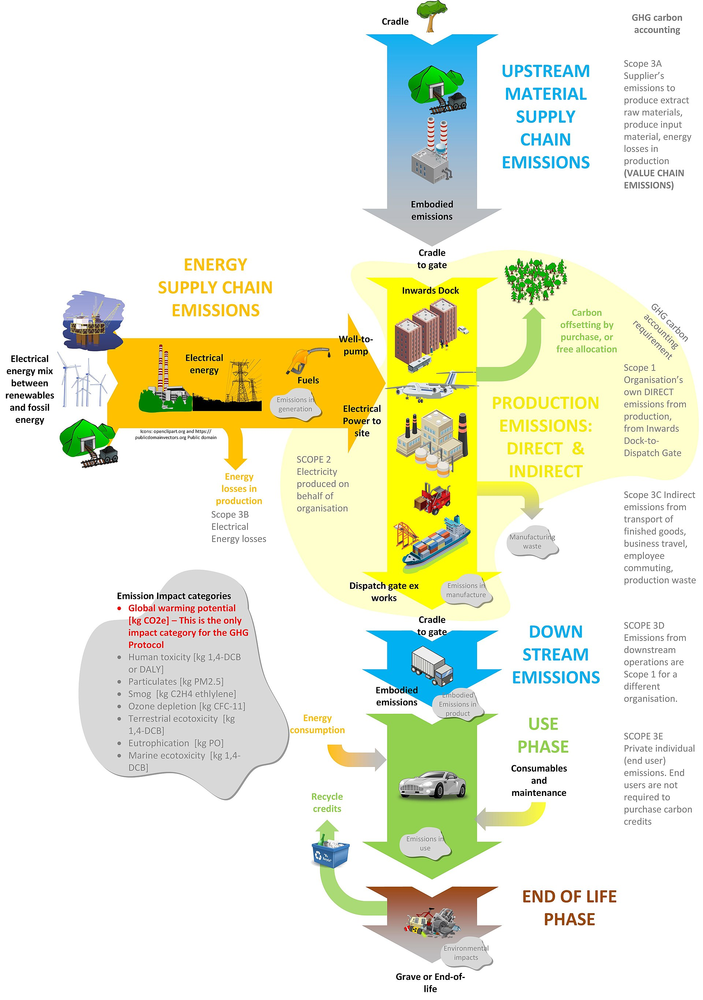

# Life Cycle Analysis for Advertising

Life cycle assessment or LCA (also known as life cycle analysis) is a methodology for assessing environmental impacts associated with all the stages of the life cycle of a commercial product, process, or service. For instance, in the case of a manufactured product, environmental impacts are assessed from raw material extraction and processing (cradle), through the product's manufacture, distribution and use, to the recycling or final disposal of the materials composing it (grave). (from ["Life-Cycle Assessment"](https://en.wikipedia.org/wiki/Life-cycle_assessment) - Wikipedia).

From [Wikipedia](https://en.wikipedia.org/wiki/File:Life_cycle_analysis_and_GHG_carbon_accounting.jpg), an LCA diagram with GHG phases along the right side

## Life Cycle Assessment of an Advertisement

To "manufacture" an ad impression, our raw materials are media (content), creative (the ad itself), and human attention (via ears and/or eyes). Different channels will have different combinations of these ingredients. For instance, a billboard often doesn't have content, just the ad.

The life cycle of an ad has five major components:

1. Producing the creative
2. Producing the content
3. Selecting which ad to display
4. Consumption of the media and creative
5. Consumer behavior after consuming the ad

Note that this project *does not* recommend a life cycle boundary; rather, it produces outputs that can be included or excluded based on the selected life cycle span.

## Methodologies

There are three well-documented methodologies that we have seen produced by the industry in addition to this project:

- [DIMPACT](https://dimpact.org/methodology)
- [SRI](https://www.sri-france.org/wp-content/uploads/2021/11/SRI_Calculating-the-carbon-footprint_VF.pdf)
- [GroupM / EY](https://www.groupm.com/media-decarbonization-framework-groupm/)

### Life cycle boundaries by methodology

| Topic | DIMPACT | SRI | GroupM / EY | Scope3
|---| --- | --- | --- | ---
| Includes creative production | No | No | Yes | Yes
| Includes content production | Partial (1) | No | Yes | Yes
| Includes ad selection | No | Partial | Yes | Yes
| Includes consumption of media and creative | Media only | Creative only | No | Yes
| Includes consumer behavior after consuming the ad | No | No | No | No

### Inclusion of emboddied emissions

Another key dimension to evaluate methodologies is whether they incorporate embodied emissions in each phase. To quote DIMPACT, "Use-phase emissions are those that result from the electricity and energy consumption of equipment used to process, transfer, and view content. What is excluded from this minimum boundary are the emissions from the raw material extraction, manufacturing, transport and installation of the equipment and devices used to serve and view digital content. These are known as ‘embodied emissions.'"

As an example from the SRI methodology:

| Topic | DIMPACT | SRI | GroupM / EY | Scope3
|---| --- | --- | --- | ---
| Includes embodied emissions for consumer device | Optional | Yes | Yes | Yes
| Includes embodied emissions for servers | Optional | No | Yes | Yes
| Includes embodied emissions for networking equipment | Optional | No | Yes | Yes

### Scope 2 / Electricity

The GHG Protocol provides two methods for tracking Scope 2 emissions: the market-based method and the location-based method.

- The market-based method: calculates emissions based on the electricity that organizations have chosen to purchase, often spelled out in contracts or instruments like Renewable Energy Certificates (RECs).

- The location-based method: calculates emissions based on the emissions intensity of the local grid area where the electricity usage occurs.

| Topic | DIMPACT | SRI | GroupM / EY | Scope3
|---| --- | --- | --- | ---
| Requires location-based emissions | Recommended | No | No | Yes

### Ad Tech Supply Chain

The ad tech supply chain is a critical component to understand emissions from media and advertising companies. It is opaque and has multiple layers of intermediaries, making it difficult to fully understand.

| Topic | DIMPACT | SRI | GroupM / EY | Scope3
|---| --- | --- | --- | ---
| Includes emissions from programmatic vendors | No | No | Yes | Yes
| Includes emissions from data and identity providers | Partial | No | ? | Yes
| Includes emissions from technology embedded into creatives | No | No | Yes | Yes

### Grid allocation

Since the electricity grid is interconnected across regions, reducing energy in one region can actually impact the grid mix in an adjacent region. For instance, while Quebec is fully renewable on its own, it also exports green power to New York. Reducing electricity use in Quebec allows more to be exported to New York, which allows New York to turn off a "peaker" coal plant. This methodology is *marginal* emissions. More information can be found [in this article](https://adgefficiency.com/energy-basics-average-vs-marginal-carbon-emissions/).

| Topic | DIMPACT | SRI | GroupM / EY | Scope3
|---| --- | --- | --- | ---
| Grid allocation mechanism | Unspecified | Unspecified | Unspecified | Marginal

## Notes

1: Includes "content management and distribution," excludes "HR systems, back-office administration, corporate business travel, and so forth." Excludes content production except when "content production is so intertwined with the operational and distribution systems that exclusion becomes impractical."

## Further investigation

- Should we incorporate other quantitative environmental issues into these methodologies? For instance, water intensity.
