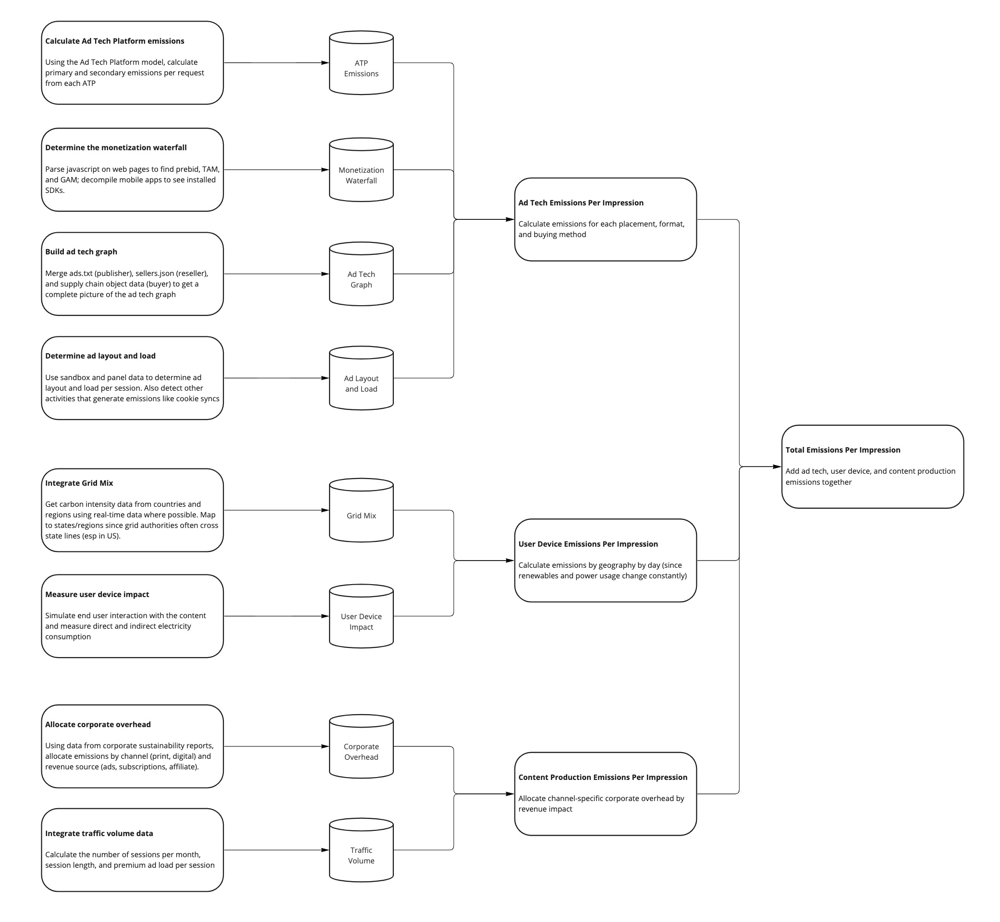

# Publisher Model
Publishers (media owners, platforms, etc) tend to be complex businesses, often with thousands of employees and complex organizational structures. Publishers often own and operate properties in different countries, sometimes with joint ventures, and have multiple revenue streams.

Modeling the emissions for a single digital ad impression on a property requires three buckets of work:
1. Allocating (and potentially modeling) corporate emissions by channel, property, and revenue stream
2. Calculating user device emissions based on regionalized grid mix data
3. Modeling the emissions from the ad tech and data used to monetize the property

This model applies to all digital media including web, mobile app, CTV, and DOOH.

### Visualizing the publisher model

# Computing Emissions from Ad Tech
Please see  docs to understand how we calculate the emissions for each ad tech platform.

## Mapping the ad tech graph
Use ads.txt - add discussion

## Determine ad layout and load
Estimate based on session length unless we have proprietary data - add discussion

## The Monetization Waterfall
When publishers determine which ad to display to a user they generally have a priority system that can be visualized as a waterfall. First, serve a sponsorship (or guaranteed, or programmatic guaranteed) campaign if one is eligible to deliver. If not, the impression spills over to an auction where the highest value impression wins. There is often a third tranche where mediation will occur, which can be thought of as a daisy chain of ad networks. Finally, a house or public-service ad will act as a default if nothing else can deliver.

In recent years, many publishers have adopted a unified yield strategy which runs the auction process before the sponsorship phase, enabling a high bid to preempt the sponsorship from serving.

From a sustainability perspective, most of the emissions from ad tech happen during the auction phase. In the waterfall model, serving a sponsorship involves a few technology partners for the publisher (the ad server and DMP) and a few for the advertiser (their ad server and brand safety provider). In the unified yield model, every ad tech platform will engage to try to bid on the impression, making a sponsorship just as costly from an emissions perspective as a programmatic campaign.

Many web publishers run multiple auctions on a single impression. The first auction is often Prebid.js running client-side, then one or more server-side auctions like Amazon's TAM. Then the impression is passed to Google Ad Manager (GAM) which calls into its Open Bidding layer. Each of these auctions makes requests to multiple ad tech platforms (SSPs, ad networks, and/or exchanges), most of which will then make requests to other ad tech platforms.

To understand how publishers interact with ad tech platforms, we need to know how many auctions they run and how these interact with each other and with the priority in the ad server. Generally, information about the monetization waterfall is not available in ads.txt or app-ads.txt. For websites, we can scan the code of the page to see client-side auctions like Prebid.js. For apps and server-side auctions, we need to get this information from publishers or make a best guess based on typical configurations.

# Calculating Consumer Device Emissions
To calculate the emissions from the consumer side of the media experience, we need to understand:
- Emissions from the device being used to consume media
- Emissions from networking between the consumer device and the edge of the internet
- Emissions to get data from the core internet to the edge

## Consumer behavior and devices
One of the challenges we face is that advertisers generally do not know if a consumer is using a laptop or desktop. Some ad tech platforms provide data on computer vs tablet vs phone, and in the TV space, we may know whether we are working through a set-top box, smart TV, or a media gateway. However, we are unlikely to know whether the consumer is on wifi or ethernet, whether they are using a large TV or a small one, whether they have a monitor attached to their computer, and so forth.

To best understand energy use across the various parts of a media property, we would want to sample user sessions and replicate their device and behavior. At Scope3, we license a consumer panel with 5M user devices that lets us simulate this at least to some degree of accuracy.

For purposes of this open-source model, a simpler way to get the basic data about a website is to use [Pingdom](https://tools.pingdom.com), which will scan a page of a site and provide basic metrics about page size, network requests, and load time (question: does this properly bypass cookie banners? If not, it understates emissions significantly). We can combine this data with the SimilarWeb data about pages per visit to estimate the time spent actively rendering a page and the time spent reading the content.

## Measuring energy use of consumer devices
This [2019 paper](https://www.researchgate.net/publication/335911295_Residential_Consumer_Electronics_Energy_Consumption_in_the_United_States_in_2017) models the use of various consumer devices in the US in 2017. Based on the analysis, about 3.5 billion devices in 119 million homes consumed 148 TWh.

This study estimates, for instance, desktop computer + monitor as using 115W when active and 59W when idle and a laptop as using 22W active and 11W idle. We can use these data to map to the loading/browsing times calculated above.

As an example, SimilarWeb shows [BZ](https://www.similarweb.com/website/bz-berlin.de/#overview) as having 2.24 pages per visit and average visit duration of 120 seconds. [Pingdom](https://tools.pingdom.com/#60b937d3cb000000) shows a load time of 1.35 seconds. For a laptop, we would model this as 3 seconds of active use per visit at 22W plus 117 seconds of idle time for a total of 0.376Wh per visit. (TODO: this should include embodied emissions).

### Our methodology
In the open source version, we ask for the above data as inputs into the calculation (in the `publisher.properties` object). In the Scope3 version, we operate a crawler that simulates loading multiple pages of each website and measures actual CPU and network usage, creating a weighted average of consumer device emissions for each domain.

## Assessing the carbon footprint of network traffic
As a sanity check on the total environmental impact of network infrastructure, this paper: [The electricity consumption and operational carbon emissions of ICT network operators](https://www.diva-portal.org/smash/get/diva2:1177210/FULLTEXT01.pdf) uses confidential information provided by network operators to produce an estimate of the total and per-subscriber emissions.
> - The total annual operational carbon emissions of the ICT networks are estimated to 169 Mtonnes CO2e for 2015. This corresponds to 0.53% of the global carbon emissions related to energy (about 32 Gtonnes), or 0.34% of all carbon emissions (about 50 Gtonnes).
> - The total annual operational electricity consumption of the overall ICT networks globally is estimated to 242 TWh for 2015 including both grid (215 TWh) and on-site generated electricity (27 TWh). The total corresponds to 1.15% of the total electricity grid supply.

The paper shows that electricity use and emissions per subscriber are relatively flat over the period 2010 to 2015 due to increased efficiency of the underlying technology (Moore's law), and demonstrates that electricity use and emissions are not growing proportionately to data transfer, which grew dramatically over this period.

The paper calculates emissions per fixed broadband (37 kgCO2e/sub) and mobile (14 kgCO2e/sub) subscribers, with an average of 19 kgCO2e per subscriber.

The same author, Jens Malmodin, produced a graphic showing the sources of power usage per user at the Science & Society Forum in Sweden in 2020:

These bottom-up numbers indicate that the majority of emissions from broadband users are fixed and change little based on data transfer, while mobile emissions are somewhat based upon data transfer (presumably because the access network uses energy to transmit more actively). An expansion of this analysis that compares to other assessments of emissions from network use can be found in *IEA (2020), [The carbon footprint of streaming video: fact-checking the headlines]( https://www.iea.org/commentaries/the-carbon-footprint-of-streaming-video-fact-checking-the-headlines), IEA, Paris*

### Our methodology
For the current version, we are using a simplistic value of 0.1 kWh per GB from the [most recent peer-reviewed study](https://www.mdpi.com/2071-1050/10/7/2494) we have found to estimate emissions from data transfer. In future versions, we will distinguish mobile and fixed broadband as well as streaming vs non-streaming use cases.

# Caveats, Complications, and Concerns

## Unified measurement across the value chain
One of the biggest challenges of trying to produce an industry standard for measuring emissions is that each participant in the value chain often has different data about a particular impression or campaign. For instance, a publisher may know the exact geographical location of a consumer from a device's GPS, but not be able to share that data with ad tech provider or advertisers due to privacy. Similarly, Google may have a deep understanding of a consumer's device if she is on Android, but have little information for consumers using Apple devices.

The risk here is that each participant will see the impression slightly differently, making it impossible to have an actionable discussion about how to make changes in buying and monetization behavior to reduce the carbon footprint of media and advertising.

Our approach has been to create statistical averages of various inputs into the model that ensure that all emissions are captured and that decisions made based on the data will have the desired effect.

For instance, a device model for a user that we know is on a personal computer of some sort. We assume that a "personal computer" is the weighted average of electricity use of a desktop (38%), laptop (62%), and monitor (52%) based on publicly-available data. By merging these together we do lose the ability to optimize a campaign to run only against laptops, which would save significant energy. However, this is not a feature available in any advertising platform that we are aware of, and even if it were, this data would not be generally available to the ecosystem at large.

## Different assumptions about emissions from data transmission
Add discussion here

## Interaction with content
When we try to replicate consumer behavior, we need to interact with the content in basic ways - scrolling, clicking to start videos, accepting (or rejecting) cookies. These are relatively complex from a technical perspective and difficult to model in context of a "typical" session. The risk here is probably that we are underestimating the CPU and network intentsity by not interacting with the content.
