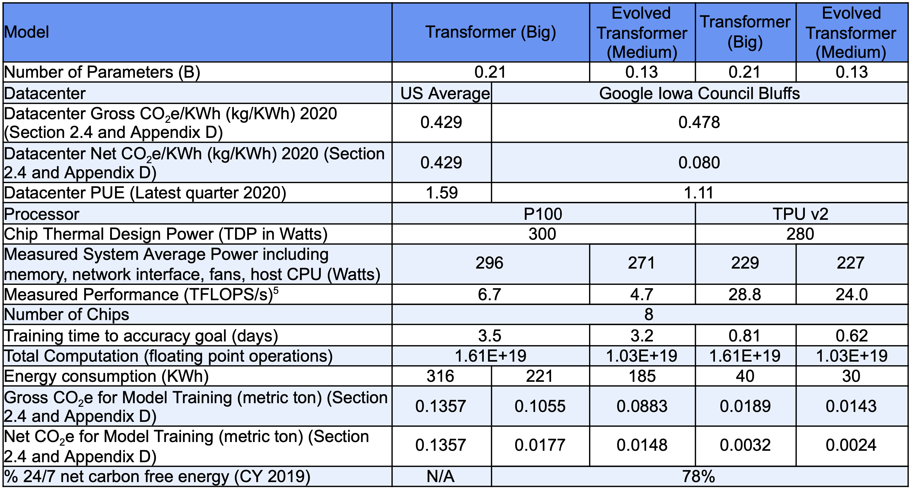

## Overview

To effectively model the water and carbon emission associated with generative AI, we first start with modeling the climate cost of training large language models. Training requires large or small models to learn from large datasets by adjusting its parameters through multiple iterations, allowing it to identify patterns and make predictions or generate outputs based on new inputs.

The key components of the training cost of the model include:
- The operational energy used to train the final model
- The operational energy used to train intermediate and preliminary models
- The embodied emissions from the cluster used to train all models, including hardware reserved but not actively deployed
- (Allocated emissions from generation of the training and test data)
- (Allocated operational and embodied emissions of development and testing infrastructure)

The methodology uses infrastructure data, referring to the resources needed to train the AI models, such as hardware specifications, location of energy grid, etc.; and operational data, referring to the consumption of resources and the process needed to train the models.  

| **Infrastructure data** | **Operational data** |
| --- | --- |
| [**Training cluster**](http://localhost:3000/cluster) details | Total reserved/owned wall clock time for intermediate and final model training |
| Training cluster location(s), including if hosted in a cloud, which region(s) | GPU hours for intermediate model training |
|  | GPU hours for final model training |

## A Note on Disclosure 

While the training costs of generative AI are often disclosed in some form, there is some variability in disclosure. Disclosure of the technical infrastructure used for training AI models is often limited. Most companies in the AI industry do not consistently provide detailed information regarding the energy consumption involved. To better assess environmental impact, model developers should disclose the technical infrastructure used for training and how this infrastructure was engaged during the training process.

As an example of a relatively complete disclosure, see Bender, E. M., Gebru, T., McMillan-Major, A., & Shmitchell, S. (2022). [**On the Dangers of Stochastic Parrots: Can Language Models Be Too Big?**](https://arxiv.org/pdf/2211.02001) *Proceedings of the 2022 ACM Conference on Fairness, Accountability, and Transparency (FAccT '22)*. Bender et. al. estimate the carbon footprint of Bloom, a 176B parameter language model, finding that the final training emitted is approximately 24.7 tonnes of CO2eq when only we considering dynamic power consumption, and 50.5 tonnes when accounting for all processes ranging from equipment manufacturing to energy-based operational consumption.

Infrastructure data                                                       

| **Component** | **Disclosed data** |
| --- | --- |
| GPU | Nvidia A100 80GB |
| Server | HPE Apollo 6500 Gen10 Plus |
| Number of GPUs | 384 |
| Number of servers | 48 |
| Training location | France |

Training data
| **Component** | **Disclosed data** |
| --- | --- |
| Total reserved time | 118 days |
| Reservation start time | January 2022 (?) |
| GPU hours for final model | 1,082,990 |

Various factors—such as the choice of GPU, the location and efficiency of the data center, the carbon intensity of the local energy grid, and the size of the AI model—significantly impact the carbon emissions generated during model training. The table from Carbon Emissions and Large Neural Network Training illustrates these impacts. 



When disclosed data is not present or not complete, we need to use predictive or heuristic data to fill in the gaps.

| Missing data point | Mechanism to replace |
| - | - |
| GPU model | Use the most common GPU for the training year (for instance, 2022 is Nvidia A100) |
| Server model | Use the most common server or instance type for the training year |
| GPUs used | Use the average cluster size for similar models |
| Servers used | Divide GPUs used by average GPUs per server |
| Location | Use the US as a relatively high-carbon country |
| Datacenter PUE | Use location average |
| Datacenter WUE | Use location average |
| Total reserved time | Use the average ratio of reserved time to GPU hours |
| Reservation start time | Use the published model date minus the total reserved time |
| GPU hours for final model | Predict using parameters and architecture per [OpenCarbonEval](https://arxiv.org/pdf/2405.12843) |
| GPU hours for intermediate models | Predict based on ratio of final to intermediate for other disclosed models |

For example, taking a look at the BLOOM model mentioned above, while the data disclosed is comprehensive, it does not include water use. To calculate water use, we use the fallbacks for the missing data points in our calculation. BLOOM provides us with the ratio of intermediate to final GPU hours of 1.45. We therefore make the following assumption: The 35.8 tons of CO2 for the intermediate models implies proportional reservation and usage as the final model (1.45x). Using the 289 days of reserved training time, we can now calculate other crucial data points. Namely the reservation start time, which is crucial because power intensity changes depending on the time of the year. The study stated an end date of June 2022, and subtracting 289 days from the finish date, takes us back to August 2021. The chart below normalizes the data the paper provides to calculate water use (below).

| **Component** | **Disclosed data** |
| --- | --- |
| Total reserved time | 289 days (118 x 1.45) |
| Reservation start time | August 2021 (finish date of June 2022 minus 289 days) |
| GPU hours for final model | 2,653,326 (1,082,990 x 1.45) |


## Calculation of carbon emissions

To calculate CO2 emissions, we use the [Software Carbon Intensity formula](https://localhost:3000/overview#co2-intensity). We need a few data points:

- The [usage energy per GPU hour](/cluster#energy-perone-gpu-hour) for the cluster
- The [embodied emissions per reserved hour](/cluster#embodied-emissions) for the cluster
- The carbon intensity of the grid in the training location(s) during the training time period

The training emissions will be:

```
Total emissions = (embodied emissions) + (usage emissions)

Embodied emissions = (cluster embodied emissions per hour) x (training time)

Usage emissions = (usage energy per GPU-hour) x (total GPU hours) x (average grid intensity during training)
```

### Example carbon calculation

For the final BLOOM model described above:

| Component | Value |
| --------- | -------------- |
| Server embodied emissions | [2500 kgCO2e](https://www.hpe.com/psnow/doc/a50005151enw) for similar model |
| GPU embodied emissions | [318 kgCO2e](https://dl.acm.org/doi/pdf/10.1145/3604930.3605705) |
| Usage energy per GPU | [428 W](https://dl.acm.org/doi/pdf/10.1145/3604930.3605705) |
| Datacenter PUE | 1.1 (Google average) |
| Grid intensity | 57 kgCO2e / kWh |
| Server use life | 4 years given rapid pace of change in GPU market |
| Projected utilization | 95% given intense demand for GPUs |

Modeling the cluster produces:
```
E(gpu-h) = (.428 kW) x (1.1)
         = .471 kW

EmbEm(h) = ((384 GPUs) x (318 kgCO2e/GPU) +
             (48 servers) x (2500 kgCO2e/server))
            / (4 years)
            / (8760 hours/year)
            / (95% utilization)
         = 7.27 kgCO2e/hour

```

Training emissions based on the normalized data:

```
EmbEm(training) = (7.27 kgCO2e/h) x (289 d) x (24 h/d)
                = 50,425 kgCO2e

OpEm(training)  = (.471 kW) x (2653326 h) x (57 kgCOw2/kWh)
                = 71,234 kgCO2e

Em(training)    = 121,659 mtCO2e
```

Note that this calculation produces a higher estimate for embodied emissions on the final model (20.6 mtCO2e) than the 11.2 mtCO2e in the BLOOM paper referenced above for three reasons. First, the embodied emissions for the A100 are higher based on a more detailed paper. Second, we use a shorter use life as hardware efficiency is increasing extremely quickly in the AI space and these servers will be obsolete more quickly than general-purpose servers. Third, we use a higher utilization number based on increased demand for GPUs.

## Calculation of water impact

The water impact of training includes:
- The water consumed to cool the servers during the training period (using the "water utilization efficiency" or WUE of the datacenter)
- The water consumed to produce the electricity used by the servers
- The water consumed to produce the chips and servers

The water impact is calculated by:
```
Datacenter water consumption = (Usage energy per GPU) x (total GPU hours) x (datacenter WUE)
Electricity water consumption = (Usage energy per GPU) x (total GPU hours) x (electricity WUE)
Manufacturing water consumption = (Cluster embodied H2O per hour) x (total training hours)
```

TODO - update above to use cluster metrics and include PUE for the scope 2 number

### Example of water impact calculation for BLOOM 176B

We now move to calculating the water usage of BLOOM 176B.

| Component | Value |
| --------- | ----- |
| Datacenter WUE |  1.8 L/kWh (US average) |
| Electricity WUE |  [3.67 L/kWh](https://files.wri.org/d8/s3fs-public/guidance-calculating-water-use-embedded-purchased-electricity_0.pdf) - note that 2022 data nuclear data from FR indicates lower numbers that WRI report |
| Manufacturing WUE | 412 L/GPU |

Modeling the cluster produces:
```
EmbH2O(h) = ((384 GPUs) x (412 L/GPU))
            / (4 years)
            / (8760 hours/year)
            / (95% utilization)
          = 4.75 L/h
```

This produces:
```
Datacenter H2O = (0.428 kW) x (2653326 hours) x 1.8 L/kWh = 2,044 kL
Electricity H2O = (0.428 kW) x (2653326 hours) x 3.67 L/kWh = 4,168 kL
Manufacturing H2O = (2832 h) x (4.75 L/h) = 13.5 kL
```

## Amortization of impact across use life

And finally, we amortize the data. We propose using a similar model to financial amortization, which projects how many inferences will happen over the use life of a model. And every month, this number is updated based on actuals. Therefore, each model should have a projected use life and will additionally track the actual and projected number of inferences for each month during that use life. As actual inference numbers are calculated each month, the projections for the remaining use life would be updated. Since actual inference numbers are sensitive, the model developer could publish the percent of amortized training cost remaining.

Therefore, the initial amortization schedule is as follows, where PI means the total projected inferences; N means the total use life in months; TC means the total training cost:


| Data point                           | Month 1     | Month 2           | Month 3         | ... | Month N |
| ------------------------------------ | ----------- | ----------------- | --------------- | --- | ------- |
| Remaining use life                   | N           | N - 1             | N - 2           |     | 0       |
| Training cost remaining (TCR)        | TC          | TC - TC / N       | TC - 2 x TC / N |     | 0       |
| Projected inferences remaining (PCR) | PI          | PI x (N - 1)      | PI X (N - 2)    |     | 0       |
| Training cost per inference (TPI)    | TCR1 / PCR1 | TCR2 / PCR2       | TCR3 / PCR3     |     | 0       |
| Training cost "billed" (TCB)         | TC/N x TPI  | TCB1 + TC/N x TPI |                 |     | TC      |

Amortization schedule after month 1

| Data point                           | Month 1     | Month 2          | Month 3           | ... | Month N |
| ------------------------------------ | ----------- | ---------------- | ----------------- | --- | ------- |
| Remaining use life                   | N           | N - 1            | N - 2             |     | 0       |
| Training cost remaining (TCR)        | TC          | TC - TCB1        | TC - TCB2         |     | 0       |
| Projected inferences remaining (PCR) | PI          | AI1 x (N - 1)    | AI1 x (N - 2)     |     | 0       |
| Training cost per inference (TPI)    | TCR1 / PCR1 | TCR2 / PCR2      | TCR3 / PCR3       |     | TC / PI |
| Actual inferences                    | AI1         |                  |                   |     |         |
| Training cost "billed" (TCB)         | AI1 x TPI   | TCB1 + AI2 x TPI |                   |     | TC      |


A general-purpose model is likely to be used heavily for a period of time then made obsolete by newer models that are more effective and/or more efficient. Specialized models may have longer use lives. Open source models enable fine tuning that will create stickiness for ongoing use.

### Example of amortization

To apply this in more concrete terms, we model chatGPT queries. Traffic to ChatGPT was [relatively flat](https://uk.pcmag.com/ai/152411/openais-gpt-4o-gives-chatgpt-a-big-traffic-bump) from April 2023 to April 2024, averaging around 50M visits a day. Assuming 5 queries per visit and 925 inferences per query, this would represent 7T inferences per month. Based on historical use-life cases, we project that each chatGPT model (GPT-4, GPT-4o) has about a 14-month use-life. Based on this alone, we now can calculate the number of inferences by multiplying 7T inferences per month by 14 months to arrive at 98T inferences in “Projected inferences remaining.”  We now can calculate the training cost per inference by dividing aggregate training cost remaining of 46 mt by the projected inferences remaining of 98T, to arrive at .46g/Mq. The initial amortization schedule would look like:


| Data point                           | Month 1     | Month 2 | Month 3 | ... | Month 14 |
| ------------------------------------ | ----------- | ------- | ------- | --- | -------- |
| Remaining use life                   | 14          | 13      | 12      |     | 0        |
| Training cost remaining (TCR)        | 46 mt       | 43 mt   | 39 mt   |     | 0        | 
| Projected inferences remaining (PCR) | 98T         | 91      | 84      |     | 0        |
| Training cost per inference (TPI)    | .46g/Mq     | .46g/Mq | .46g/Mq |     | 0        |
| Training cost "billed" (TCB)         | 3 mt        | 3 mt    | 3 mt    |     | 0        |

Now, let’s apply these projects to actual data. With the impending release of GPT-4o, a reasonable projection would be that traffic would continue at the same rate, and that the model lifecycle would be around a year given the 14-month gap between GPT-4 and GPT-4o. What actually happened was that thanks to the new model, traffic to chatgpt.com increased by 55% in June 2024 after the release of GPT-4o. 

| Data point                           | Month 1     | Month 2 | Month 3 | ... | Month 14 |
| ------------------------------------ | ----------- | ------- | ------- | --- | -------- |
| Remaining use life                   | 14          | 13      | 12      |     | 0        |
| Training cost remaining (TCR)        | 46 mt       | 41 mt   | 38 mt   |     | 0        | 
| Projected inferences remaining (PCR) | 98T         | 143T    | 132T    |     | 0        |
| Training cost per inference (TPI)    | .46g/Mq     | .28g/Mq | .28g/Mq |     | 0        |
| Actual inferences                    | 11T         |         |         |     |          |
| Training cost "billed" (TCB)         | 5 mt        |         |         |     |          |

The spike in traffic means that the model was effectively overbilled in month 1, making the projected training cost per inference much lower thanks to higher projected volume and the lower remaining training cost.

It is important to note that this data is not meant to be exact, given the assumptions made, but to model the kinds of calculations and frameworks we would use once data is provided. For future iterations of this model, we plan to explore the following: 

- How to estimate projected inferences and use life for a new model (vs an upgrade)
- How to estimate actual inferences for a closed model that doesn’t disclose usage
- How to estimate actual inferences for an open source model like LLAMA where the use is not happening in a centralized fashion

